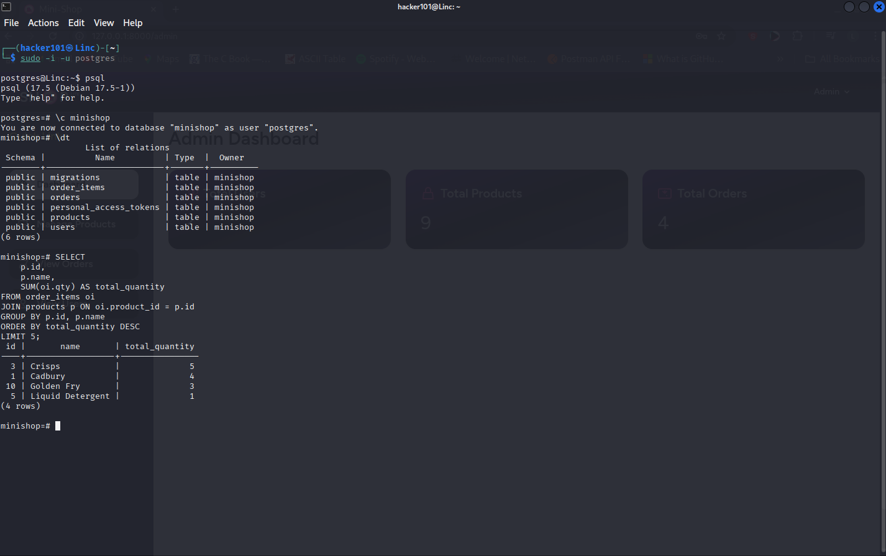
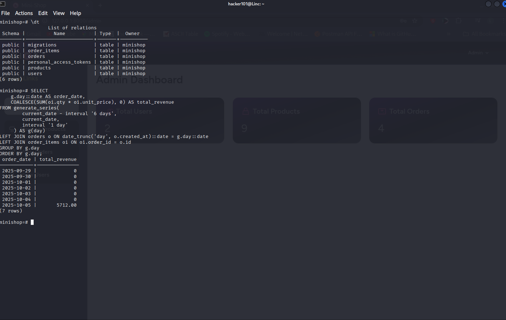
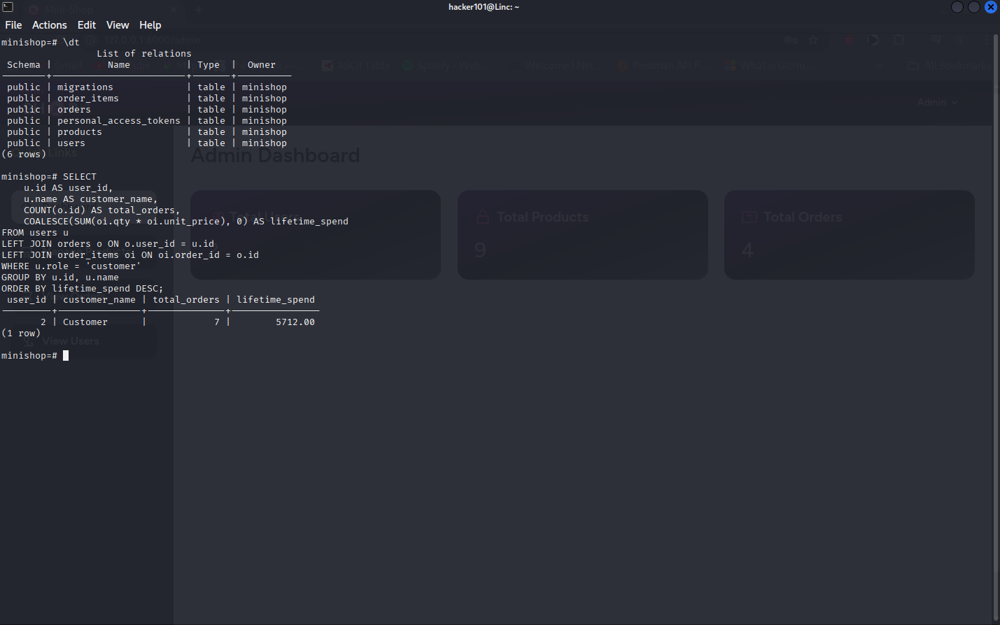

# Mini Shop Lite — Laravel Full-Stack Assessment

**Author:** Lincoln Madaraka  
**Role:** Red Giant Laravel Full-Stack Intern Assessment  
**Due:** Sunday, Oct 5, 2025 at 5:00 pm (EAT)

---

## Table of Contents
1. [Project Overview](#project-overview)
2. [Setup Instructions](#setup-instructions)
3. [Seeded Users & Products](#seeded-users--products)
4. [File Structure & Description](#file-structure--description)
5. [Usage](#usage)
   - [Frontend](#frontend)
   - [API](#api)
6. [Screenshots](#screenshots)
7. [SQL Queries](#sql-queries)
8. [Optional Live Demo](#optional-live-demo)

---

## Project Overview

Mini Shop Lite is a **Laravel 10/11 full-stack application** that allows:

- **Admin:** manage products, view orders, manage users.  
- **Customer:** browse products, add to cart, checkout, view orders.  
- **API Endpoints:** public `GET /api/products` and authenticated `POST /api/orders`.  
- **Validation:** clean input validation, proper error handling, and stock management.  
- **Frontend:** Blade templates with Tailwind CSS for responsive and clean UI.  

---

## Setup Instructions

1. Clone the repo:

```bash
git clone https://github.com/Lincoln-Madaraka/mini-shop.git
cd mini-shop
```
2. Install dependencies:
```bash
composer install
npm install
npm run dev
```
3. Create .env file (copy .env.example) and set database connection:
```bash
DB_CONNECTION=pgsql
DB_HOST=127.0.0.1
DB_PORT=5432
DB_DATABASE=minishop
DB_USERNAME=postgres/<if-different-change>
DB_PASSWORD=<your-db-password>
```

4. Run migrations and seeders:
```bash
php artisan migrate:fresh --seed
```
5. Serve the app locally:
```bash
php artisan serve
```
6. Access at http://127.0.0.1:8000

7. Seeded Users & Products
```bash
Users
Role	    Email	               Password

Admin	    admin@demo.com       password

Customer	customer@demo.com    password
```
8. Products
- There are some sample products seeded using ProductSeeder.php
- Images stored in public/import/assets
- Products include snacks, electronics, beverages, and detergents

### Folder Structure and Brief Description(Main Folders in key)
```bash
minishop/
├── app/
│   ├── Http/
│   │   ├── Controllers/
│   │   │   ├── Admin/      # Admin CRUD: products, users, orders
│   │   │   ├── Api/        # ProductController.php: GET /api/products
│   │   │   │                # OrderController.php: POST /api/orders
│   │   │   ├── Auth/       # Breeze authentication controllers
│   │   │   └── Shop/       # Customer shopping: CartController.php, CheckoutController.php, OrderController.php, ProductController.php
│   │   ├── Middleware/     # Role-based access control
│   │   └── Requests/       # Validation rules for forms
│   ├── Models/
│   │   ├── User.php        # User roles and authentication
│   │   ├── Role.php        # Role constants/logic
│   │   ├── Product.php     # Product logic and stock
│   │   ├── Order.php       # Orders table
│   │   └── OrderItem.php   # Individual order items
├── database/
│   ├── migrations/         # Database tables: users, products, orders, order_items
│   └── seeders/            # DatabaseSeeder.php: seeds users
│                            # ProductSeeder.php: seeds products
├── resources/views/        # Blade templates
│   ├── admin/              # Admin panel pages
│   ├── auth/               # Login/Register
│   ├── shop/               # Customer catalog, cart, checkout
│   └── layouts/            # Base layouts
├── routes/
│   ├── web.php             # Web routes
│   └── api.php             # API routes: GET /api/products, POST /api/orders
├── public/                 # Entry point, product images
├── artisan                 # Laravel CLI
├── composer.json           # PHP dependencies
├── tailwind.config.js      # Optional styling
└── README.md
```
### Usage
**Frontend**
1. Log in as Admin:
```bash
Email: admin@demo.com
Password: password
```
2. Manage products, users, and orders

---
1. Log in as Customer:
```bash
Email: customer@demo.com
Password: password
```
2. Browse catalog, add products to cart, checkout.

### API
1. GET Products
```bash
curl -i http://127.0.0.1:8000/api/products
```
Returns JSON list of all products with id, name, price, stock, and description.

2. POST Orders
```bash
curl -i -X POST "http://127.0.0.1:8000/api/orders" \
  -H "Accept: application/json" \
  -H "Authorization: Bearer <your-token>" \
  -H "Content-Type: application/json" \
  -d '{
    "items": [
      {"product_id":1,"qty":2},
      {"product_id":3,"qty":1}
    ]
  }'
 ```
- Requires a Sanctum token for authentication
- Returns JSON with order details, user ID, total, and item breakdown

### Screenshots
**Top Selling Products**
This screenshot shows the top 5 products based on total quantity sold.

**Total Revenue per Day (Last 7 Days)**
Shows total revenue per day including days with no orders.

**Customer Orders & Lifetime Spend**
Displays each customer’s total number of orders and lifetime spend.


### Visual Cards 
Video Demo: 